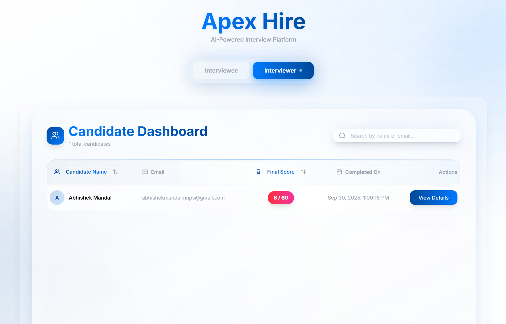

# 🤖 ApexHire: AI-Powered Interview Assistant  
## 🚀 Demo  

🔗 [Live Demo](https://apex-hire-8pej0evvr-abhishek-mandals-projects-e004a46c.vercel.app/)


*ApexHire is a modern, full-stack web application designed to automate and streamline the initial technical screening process. It serves as an intelligent assistant for both candidates and recruiters, providing a seamless, automated, and data-driven interview experience.*  

**Objective & Benefits:**  
The primary objective of ApexHire is to create an efficient, unbiased, and scalable solution for first-round technical interviews. By leveraging a generative AI, the platform saves valuable time for hiring managers while providing candidates with an immediate opportunity to demonstrate their skills in a simulated, real-world environment. It ensures every candidate is evaluated on a consistent set of metrics, focusing purely on technical merit.

---

## 🏗 How It's Built  

This platform is a **modern single-page application**:  

- **Frontend:** React 18 + TypeScript, built with Vite  
- **State Management:** Redux Toolkit + Redux Persist  
- **Styling & UI:** Tailwind CSS, shadcn/ui, Framer Motion, Lucide React  
- **Backend & AI:** Vercel Serverless Functions + Google Gemini API  
- **Routing:** React Router DOM  
- **Utilities:** pdf.js, Tone.js, date-fns, uuid, clsx  
- **Deployment:** Vercel  

---

## ✨ Features  

### 👨‍💻 For the Interviewee  

- 📝 **Seamless Onboarding:** Upload a resume (PDF/DOCX) and AI extracts contact details.  
- 🔍 **Intelligent Validation:** Chatbot prompts only for missing/incorrect details.  
- ⏱ **Timed Interview Simulation:** 6 questions progressing from easy → medium → hard (Full-stack concepts).  
- ⚡ **Automated Flow:** Auto-progresses questions, auto-submits answers on timer expiry.  
- 📊 **Instant Feedback:** Final score immediately after completion.  
- 🎨 **Engaging Experience:** Polished UI, subtle audio cues, and smooth animations.  

### 🧑‍💼 For the Interviewer  

- 📋 **Centralized Dashboard:** Lists all completed candidates, sorted by final score.  
- 📈 **Data-Driven Insights:** Candidate name, email, final score at a glance.  
- 🔎 **In-Depth Candidate Reports:** Detailed modal for profile, AI summary, question-by-question transcript with scores and justifications.  
- 🛠 **Powerful Filtering:** Search candidates by name or email.  
- ↕️ **Dynamic Sorting:** Sort candidate table by name or score.  

---

## 🔄 Project Flow  

  

*Candidate uploads resume → AI parses info → Timed Interview → Auto-scoring → Interviewer Dashboard → Candidate Report → Analytics & Insights*

---

## 🖼 Screenshots  

<table>
<tr>
<td></td>
</tr>
<tr>
<td></td>
<td></td>
</tr>
<tr>
<td></td>
<td></td>
</tr>
</table>

---

## 🛠 Tech Stack  

<div align="center">
  <!-- Frontend -->
  
  
  
</div>

<div align="center" style="margin-top: 10px;">
  <!-- Styling/UI -->
  
  
  
  
</div>

<div align="center" style="margin-top: 10px;">
  <!-- State & Persistence -->
  
  
</div>

<div align="center" style="margin-top: 10px;">
  <!-- Backend & AI -->
  
  
</div>

<div align="center" style="margin-top: 10px;">
  <!-- Utilities -->
  
  
  
  
  
</div>

---

## ⚡ Installation  

```bash
# Clone the repo
git clone https://github.com/yourusername/apexhire.git

# Go inside project folder
cd apexhire

# Install dependencies
npm install

# Start development server
npm run dev
```
---

## 📬 Contact  

- **Author:** Abhishek Mandal 
- **Portfolio:**  https://portfolio-ochre-two-qb2e3w3aci.vercel.app/
- **LinkedIn:**  http://www.linkedin.com/in/abhishek-mandal-274475271/
- **Email:** abhishekmandalmnps@gmail.com  
